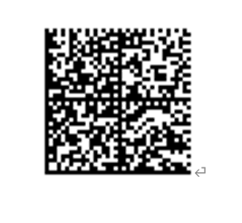
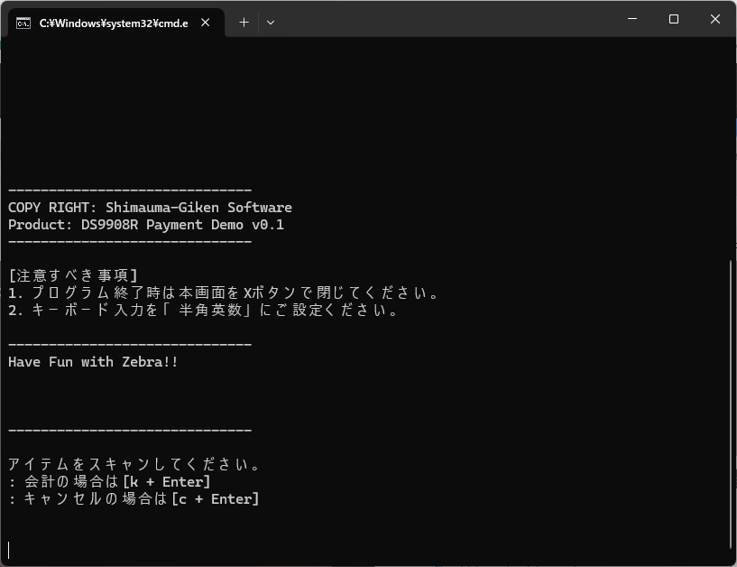
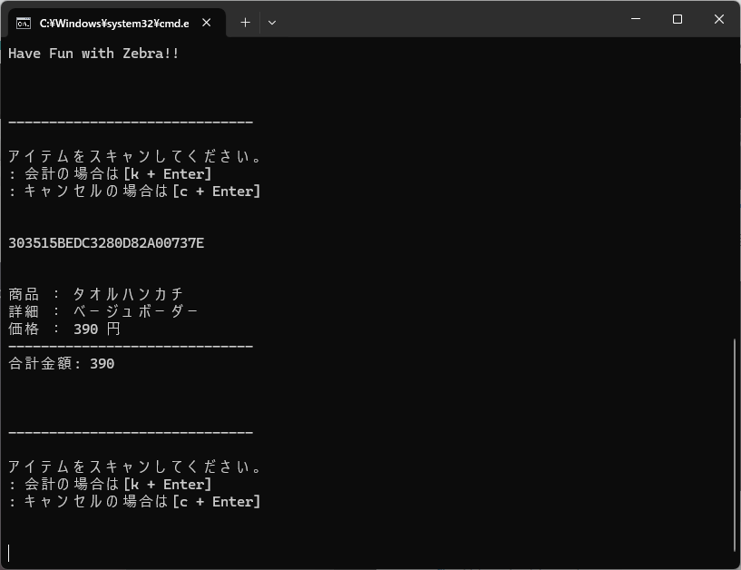
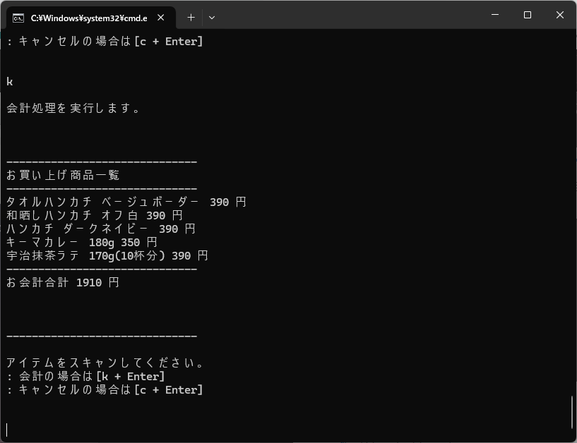

### DS9908Rデモプログラム： リテールレジでバーコードとRFタグを読んで精算する(Python編)

 

 

 RFIDタグとJAN商品が混在している小売り企業にとって、精算時にRFタグとバーコードのスキャンで別リーダーを切り替えて使うのは効率が悪い上、レジ担当によっては苦痛であり、お客様にとっても不便である。ゼブラのDS9908RはRFリーダーとバーコードスキャナが１台に集約されているので、RFとバーコードが混在していてもストレスフリーでレジ作業が実施可能。

 本スレッドでは下記のような方向けに簡易的なデモを実施するための環境作成方法を説明する。

- 営業デモを通してDS9908Rの機能、パフォーマンスを紹介したい
- DS9908Rがどのように動作するのか簡易的に体験したい

 
 

#### デモに必要なマテリアル。

1. Windows PC (Win10以上、Python3がインストールされていること)
2. Zebra Technolgoies DS9908R
3. 下記バーコードラベル、またはRFIDタグ *

 

| ラベル種   | アイテム名                                  | JAN バーコード | EPC                      |
| ---------- | ------------------------------------------- | -------------- | ------------------------ |
| ラベル     | "宇治抹茶ラテ", "170g(10杯分)", 390円       | 4550583992545  | -                        |
| ラベル     | "キーマカレー", "180g", 350円               | 4550002861308  | -                        |
| RFIDラベル | "タオルハンカチ", "ベージュボーダー", 390円 | 4550583517151  | 303515BEDC3280D82A00737E |
| RFIDラベル | "ハンカチ", "ダークネイビー", 390円         | 4550584128189  | 303515BEE00C84982A00429B |
| RFIDラベル | "和晒しハンカチ", "オフ白", 390円           | 4550583517212  | 303515BEDC32825824004393 |

\* Sample.py変更により、任意のJAN/EPCが利用可能。
\* Zebra RFIDプリンタで作成可。

 
 

#### デモ環境構築手順

1. DS9908Rを初期化する。
2. DS9908Rにて下記バーコードをスキャンする。

   

    
3. 本スレッドのSampleProgramsフォルダーをPCにダウンロードする。

 

##### [備考] (中級者以上向け)

本サンプルのDS9908Rの設定の確認や変更をしたい場合は拡張子（scncfg)ファイルを123Scanで開いて確認すること。

 
 

#### デモ実行方法

1. DS9908RをWin PCとUSB接続する。
2. ダウンロードしたSampleProgramsフォルダー配下の"start-demo.bat"を実行するとデモプログラムが実行される。

   

    
3. 任意のJANコード、もしくは、RFタグを読む。

   

    
4. 会計の際は [k + Enter] を入力する。

   

    

    

#### 会計時にレシート印刷をする場合（中級者向け）

本サンプルプログラムではレシート印刷処理の部分はコメントアウトされている。必要に応じてコードを改変することで任意のレシートやラベル印刷が可能。

 
 

Thank you for watching! 
Have Fun with Zebra!
